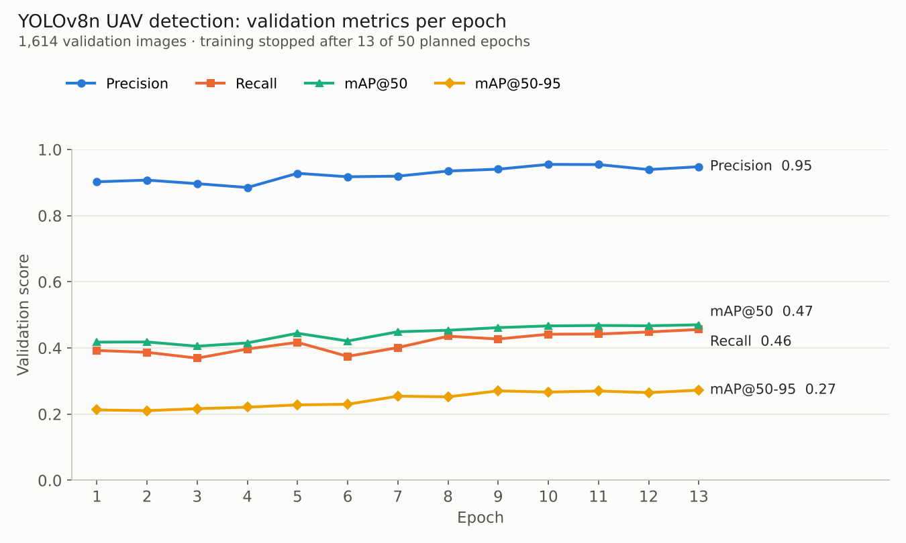
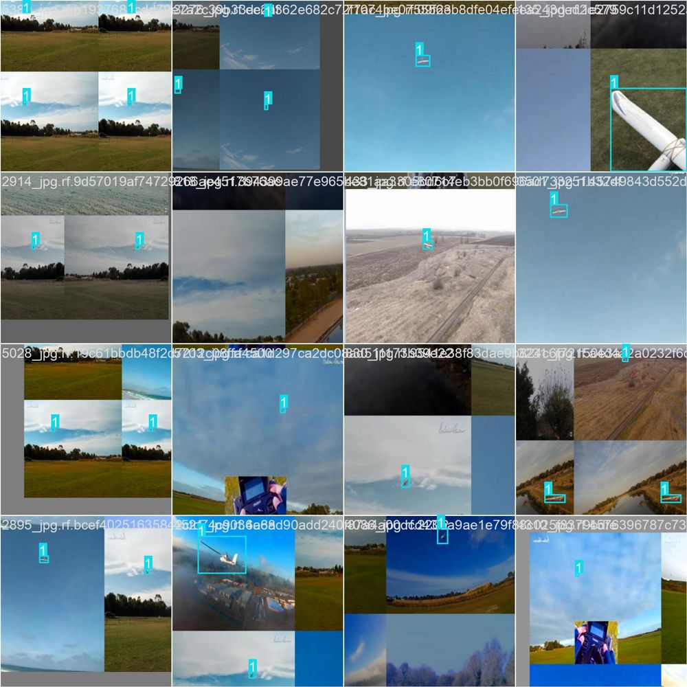
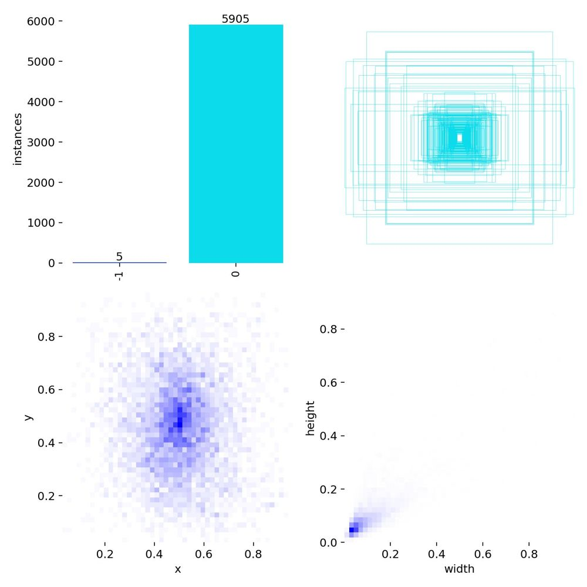

# UAV Detection with YOLOv8

Detecting fixed-wing UAVs in camera footage with a fine-tuned **YOLOv8n** model. This is the vision module I worked on for the **TEKNOFEST Fighter UAV (Savaşan İHA)** competition, where one aircraft has to find and lock onto another from its onboard camera.

> 🇹🇷 TEKNOFEST Savaşan İHA yarışması için geliştirdiğim, kamera görüntüsünde rakip İHA'yı tespit eden YOLOv8n modeli.



## Results

The model was trained on Google Colab (Tesla T4) and validated on 1,614 held-out images. These are the numbers after the last completed epoch:

| Metric | Value |
|---|---|
| Precision | 0.95 |
| Recall | 0.46 |
| mAP@50 | 0.47 |
| mAP@50-95 | 0.27 |

**What this means:** when the model says "UAV", it is almost always right (high precision), but it still misses about half of the targets (low recall). Most targets are tiny, often under 5% of the frame (see the label distribution below), which is the hardest case for a nano-sized model at 640 px.

The run stopped after **13 of the 50 planned epochs**, while mAP and recall were still climbing. Next steps are on the roadmap below.

## Dataset

- Roboflow project `uavson` (workspace `muhammet-hasan-akcesme`), version 1, exported in YOLOv8 format
- 5,648 training and 1,614 validation images, with about 5.9k labeled boxes
- Almost all labels belong to a single UAV class

| Training batch (mosaic augmentation) | Label statistics |
|---|---|
|  |  |

## Training setup

| | |
|---|---|
| Base model | `yolov8n.pt` (COCO-pretrained, 3.0M parameters) |
| Image size | 640 |
| Batch | 16 |
| Optimizer | AdamW (auto), lr 0.00167 |
| Augmentation | mosaic, HSV jitter, scale/translate, horizontal flip |
| Hardware | Google Colab, Tesla T4, mixed precision |

The full Ultralytics config is in [`configs/train_args.yaml`](configs/train_args.yaml), and per-epoch numbers are in [`results/results.csv`](results/results.csv).

## Usage

```bash
pip install -r requirements.txt
```

**Inference.** Put the trained weights at `weights/best.pt`, then:

```bash
python detect.py --source path/to/image.jpg
python detect.py --source flight_video.mp4 --conf 0.35
python detect.py --source 0          # webcam
```

Annotated images and videos are written to `runs/detect/`.

**Training.** Use [`train_colab.ipynb`](train_colab.ipynb) on Colab, or run locally:

```bash
export ROBOFLOW_API_KEY=your_key      # Windows: set ROBOFLOW_API_KEY=your_key
python train.py --download --epochs 50
python train.py --resume runs/savasan_iha/weights/last.pt   # continue a stopped run
```

## Project structure

```
├── detect.py            # inference on images, videos, webcam
├── train.py             # training / resuming (Ultralytics API)
├── train_colab.ipynb    # same pipeline as a Colab notebook
├── configs/
│   └── train_args.yaml  # exact hyperparameters of the run
└── results/             # metrics, plots, sample batch
```

## Roadmap

- [ ] Finish the full 50-epoch run (resume from `last.pt`)
- [ ] Try a larger input size (960–1280) or SAHI tiled inference for small, distant targets
- [ ] Compare with YOLOv8s
- [ ] Add tracking (ByteTrack) so the lock-on box stays stable between frames
- [ ] Export to ONNX/TensorRT for onboard hardware

## Tech

Python · PyTorch · Ultralytics YOLOv8 · OpenCV · Roboflow · Google Colab
